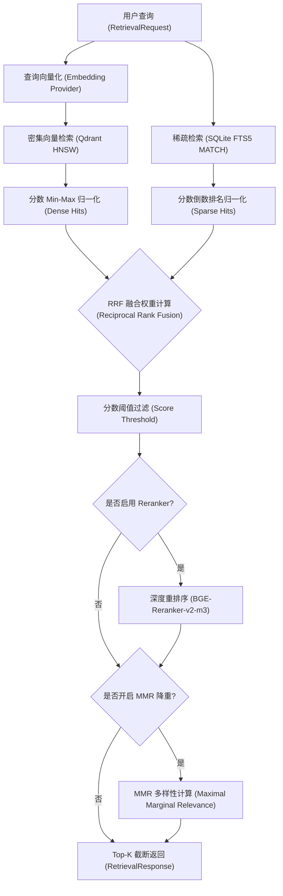
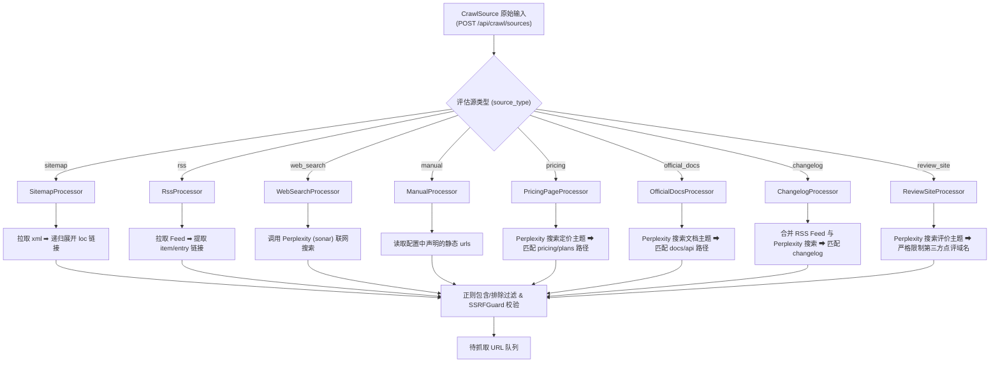
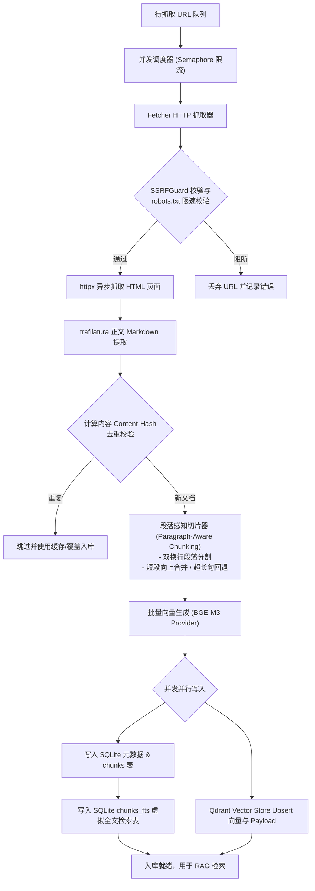

# 知识库与爬虫子系统架构图 (Architecture Diagrams)

本文档使用 Mermaid 流程图直观展示 **Competiscope v2 (Plan A)** 知识库和爬虫子系统的核心链路，包含：(a) 完整的 RAG 检索管道，(b) 爬虫源的展开与过滤扩展，以及 (c) 并发网页抓取与结构化入库流程。

详细的接口定义、配置参数以及端到端演示流程请参阅 [知识库与爬虫子系统用户指南](USER_GUIDE.md)。

---

## (a) 完整的 RAG 检索管道 (Full RAG Pipeline)

该图展示了从前端收到 `RetrievalRequest` 开始，如何将密集检索（Dense Retrieval）与稀疏检索（Sparse Keyword Retrieval）结果并行搜集，并最终通过互反排名融合（RRF）、模型重排（Rerank）以及最大边界相关性降重（MMR）返回给 Agent 提示词作为上下文的过程。

---

## (b) 爬虫源扩展流程 (Crawler Source Expansion)

该图展示了 `scheduler.py` 与 `sources.py` 中 8 种不同的源类型（Source Types）是如何通过各自特定的 `SourceProcessor` 执行网络检索、协议展开或路径正则映射，将其从抽象定义转换为实体 URL 队列的。

---

## (c) 结构化入库流程 (Ingestion Flow)

该图展示了网页 URL 经过并发管理器，执行 Robots 协议及安全准入检查，完成 HTML 内容的下载、解析和正文提取，随后通过段落感知分块，生成多维度密集向量，最终并行存入 SQLite 关系全文检索数据库和 Qdrant 向量数据库的闭环。

