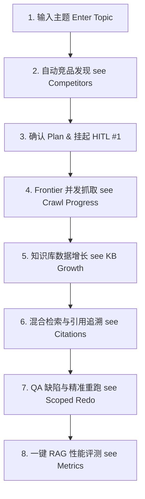
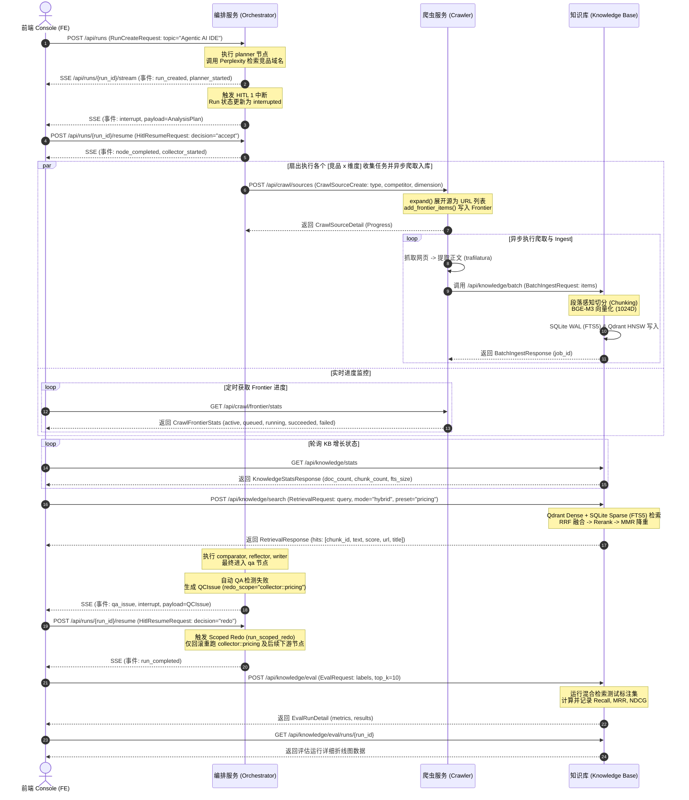
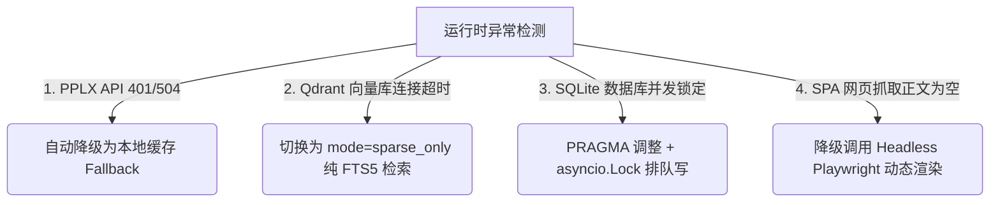

# Competiscope v2 (Plan A) Phase 9.6 端到端演示流程设计方案

本文档设计了 **Competiscope v2 (Plan A)** 竞争情报分析系统在 **Phase 9.6** 阶段的端到端（E2E）演示流程。本设计旨在将基于 LangGraph 的多 Agent 分析流（Orchestrator）与爬虫任务（Crawler）及知识库混合检索与评估（Knowledge Base）子系统深度融合，全面展示系统的核心技术亮点，包括：**图驱动运行拓扑（Graph-Driven Topology）**、**双重人机协同中断（HITL Interrupts）**、**局部精准重跑（Scoped Redo）**、**混合密集-稀疏检索（Dense-Sparse Hybrid Search）** 以及 **RAG 自动化性能评测（RAG Evaluation）**。

详细的系统配置、各源类型展开逻辑以及常见问题排查请参阅 [知识库与爬虫子系统用户指南](USER_GUIDE.md)。

---

## 1. 用户旅程 (User Journey)

演示的用户旅程共包含 **8 个连续视觉阶段**，向用户直观呈现系统从输入宏观概念到最终产出并评测高质量对比报告的完整闭环。



1. **阶段 1：输入宏观主题 (Enter Topic)**  
   演示者进入 Console 控制台，在主分析框中输入宏观的分析主题（例如：`"Agentic AI IDE"`），且**不硬编码**具体竞品。

2. **阶段 2：自动竞品发现 (See Competitors)**  
   Orchestrator 接收请求并执行 `planner` 节点。利用大语言模型配合 Perplexity 联网检索组件，在数秒内自动识别出该领域的 top-3 竞品（如 `Cursor`、`Windsurf`、`Copilot Workspace`），获取其官方域名，并拟定包含 `feature`、`pricing`、`integration` 等维度的 `AnalysisPlan`。

3. **阶段 3：第一次人机协同中断 (HITL Interrupt #1)**  
   Orchestrator 状态变更为 `interrupted`，并在前端弹窗挂起。演示者在前端页面上审核自动生成的 Plan，可以手动增删竞品（如加入本地 Mock 竞品）或拖拽调整分析维度，随后点击 “Approve & Proceed” 恢复执行。

4. **阶段 4：Frontier 并发抓取可视化 (See Crawl Progress)**  
   随着分析管线扇出到 `collector` 节点，爬虫子系统被唤醒。前端展示 **Crawl Frontier 实时监控器**，以环形图及动态滚动日志展示 URL 在待爬队列 (`queued`)、正在爬取 (`running`)、爬取成功 (`succeeded`) 和失败 (`failed`) 之间的状态迁移。

5. **阶段 5：知识库实时增长 (See KB Growth)**  
   抓取成功的网页正文立即通过 `IngestionPipeline` 切片并写入 SQLite 全文检索 (FTS5) 和 Qdrant 密集向量数据库。控制台顶部的 **Knowledge Stats 计数器** 实时跳动，文档数（Doc Count）和分块数（Chunk Count）以绿色跳涨动画呈现。

6. **阶段 6：实时检索与引用追溯 (See Citations)**  
   在 `analyst` 与 `comparator` 运行期间，演示者可拉出 **RAG 检索实验室抽屉** 输入 Query。页面展示基于密集-稀疏混合检索和 MMR 降重后的 Chunks。每个 Chunk 均带有可点击的 Citation 标识。点击引用标签，右侧将以浮层显示 SQLite 中的原始网页片段及 URL 归因，确保生成的 Comparison Matrix 毫无幻觉。

7. **阶段 7：QA 拦截与精准重跑 (See Scoped Redo)**  
   分析生成的 Markdown 报告在 `qa` 节点被拦截（例如模拟竞品 B 的定价信息不完整，产生 Block 级别的 `QCIssue` 并自动指派 `redo_scope = "collector::pricing"`）。系统触发 **HITL Interrupt #2** 并挂起。演示者确认后，LangGraph 拓扑**不会从头重跑**，而是精准定位回 `collector` 中对应竞品定价的并发分支，重新抓取补全数据并自动合并入库，数秒内迅速修正报告并通关。

8. **阶段 8：一键 RAG 性能评测与指标 (See Metrics)**  
   报告产出后，演示者切换至 Knowledge Base 评估面板，点击 “Run RAG Evaluation”。系统运行预设的 Labeled Query 集，计算并渲染出 Recall@K、MRR 和 NDCG@K 曲线大屏，以量化指标向客户证明混合检索的稳定性。

---

## 2. API 端点调用顺序 (API Endpoint Sequence)

以下时序图展示了前端控制台 (FE Console)、编排服务 (Orchestrator)、爬虫调度器 (Crawler) 及知识库管理层 (Knowledge Base) 在整个端到端流程中的 API 交互顺序：



---

## 3. 前端页面布局与新增组件 (Frontend UI Layout)

为支撑 Phase 9.6 演示，前端控制台复用了已有的 **Run Dashboard (分析看板)** 和 **Knowledge Base Manager (知识库管理面)**，并在这两个核心界面中嵌入了以下 **4 个定制化新组件**：

### 3.1 Run Dashboard 现有页面调整
- **主区域**：保留原有的 LangGraph 运行拓扑图（拓扑节点会随 `planner` -> `collector` -> `analyst` -> `comparator` -> `reflector` -> `writer` -> `qa` 的转移而高亮闪烁）。
- **右侧面板**：在运行状态栏下，嵌入 **Frontier 并发抓取监视器 (Crawl Frontier Monitor)**。
- **底部悬浮窗**：当触发 QA 警报进入 HITL #2 时，弹出 **Scoped Redo 控制中心**。

### 3.2 页面新增组件设计

#### 1. Frontier 实时抓取监视器 (Crawl Frontier Monitor Panel)
*   **组件位置**：Run Dashboard 侧边栏（进入 `collector` 节点时展开）。
*   **视觉设计**：
    *   顶部包含一个高对比度的环形进度图（用不同颜色区分：排队中-黄色，进行中-蓝色，成功-绿色，失败-红色）。
    *   环形图中心显示当前已完成 URL 总数（如 `128 / 150`）。
    *   下方是一个带磨砂玻璃质感的实时控制台日志框（Console output），流式滚动展示爬虫抓取的即时状态：
        ```text
        [11:34:12] [Crawl] Enqueued: https://cursor.com/features (Priority: 100)
        [11:34:13] [Fetch] Fetching: https://windsurf.ai/changelog ...
        [11:34:14] [Trafilatura] Extracted 4,200 chars text from windsurf.ai
        [11:34:15] [Ingest] Successfully batch-ingested: doc-ws-changelog-01
        ```

#### 2. 知识库实时增长微件 (Realtime KB Growth Widget)
*   **组件位置**：FE 导航栏右上角，紧邻知识库入口图标。
*   **视觉设计**：
    *   一个胶囊状的微件，包含两个实时数字：`Docs: {count}` | `Chunks: {count}`。
    *   **跳动特效**：每当后端爬虫成功 Ingest 批次数据，该微件背景发出绿色呼吸光晕，数字以数字翻滚（Ticker）特效递增，极大地增强了演示的“实时感”。

#### 3. RAG 检索实验室抽屉与引用浮层 (RAG Playground Drawer & Citations Context Overlay)
*   **组件位置**：Run Dashboard 或 Knowledge Base Manager 的侧边抽屉。
*   **交互机制**：
    *   提供检索输入框，支持选择检索预设（下拉框：`General` / `Pricing` / `Comparison`）。
    *   结果展示区域，每个被检索到的 Chunk 渲染为一个卡片，其右上角标明匹配分数（Score）与引用来源标签，如 `[Cursor Pricing Page #L45]`。
    *   **引用悬浮窗 (Citation Context Overlay)**：鼠标悬停在引用标签上，系统弹出一个优雅的 Overlay（气泡浮层），从 SQLite 中读取并渲染带行号的原始抓取段落。若点击引用，会在右侧分栏中直接打开源文档的高亮模式，清晰回溯事实源头。

#### 4. RAG 评估指标看板 (RAG Evaluation Dashboard)
*   **组件位置**：Knowledge Base Manager 页面的新选项卡 (Tab)。
*   **图表设计**：
    *   **仪表盘大屏**：顶部排列三个大数字卡片，分别显示最新运行的 `Recall@10`、`MRR` 和 `NDCG@10` 得分（配合红绿箭头代表较上一次评估的增减百分比）。
    *   **核心图表**：双 Y 轴折线图。X 轴为召回深度 K 的取值（1至20），左 Y 轴为召回率，右 Y 轴为 NDCG。支持多条历史运行曲线的叠图对比。
    *   **Bad Cases 对比列表**：在底部展示评估中指标过低（如 NDCG < 0.5）的 Query。点击可在分栏中直接对比 Ground Truth 标记的 Chunk 与系统实际召回的 Chunks 差异，帮助工程师迅速定位 Rerank 或切片参数的缺陷。

---

## 4. 真实测试场景设计 (Test Scenarios)

为展示系统的泛化能力，我们设计了 **3 个涵盖不同垂直主题的真实测试场景**，演示者可在演示过程中任选其一执行：

### 场景 1：Agentic AI IDE 竞争情报 (协同与开发维度)
*   **分析主题**：`"Agentic AI IDE"`
*   **参数配置**：`dimensions=["feature", "integration"]`, `execution_mode="real"`
*   **预期自动发现的竞品**：`["Cursor", "Windsurf", "Copilot Workspace"]`
*   **Crawl Sources 及展开逻辑**：
    1.  `official_docs://?competitor=Cursor`：自动检索 Cursor 官方文档链接，抓取并过滤得到约 40 个 API 与功能介绍页面。
    2.  `changelog://?competitor=Windsurf`：调用 PPLX 搜索其更新日志，提取出博客中的 Release Notes。
*   **数据集预期规模**：文档 120 个，切片 (Chunks) 约 700 个。
*   **检索实验室演示问题**：`"Compare the local model execution support in Windsurf vs Cursor."`

### 场景 2：SaaS 知识库协作平台 (定价与舆情维度)
*   **分析主题**：`"Collaborative Enterprise Knowledge Bases"`
*   **参数配置**：`dimensions=["pricing", "community"]`, `execution_mode="real"`
*   **预期自动发现的竞品**：`["Notion", "Confluence", "Linear Documents"]`
*   **Crawl Sources 及展开逻辑**：
    1.  `pricing://?competitor=Notion`：展开为 Notion 官网的 /pricing 页面及相关帮助中心关于 Enterprise billing 的说明。
    2.  `review_site://?competitor=Confluence`：将搜索链接锁定在 `g2.com` 和 `capterra.com`，展开为 30 条用户对 Confluence 性能和费用的评价。
*   **数据集预期规模**：文档 180 个，切片 (Chunks) 约 1100 个。
*   **检索实验室演示问题**：`"What is the billing unit for Notion Enterprise workspace and does it have a free tier?"`
*   **检索预设选择**：选择 `pricing` 预设（降低 Dense 权重，开启 SQLite FTS5 的强行数字匹配，防止数字漂移）。

### 场景 3：矢量 UI 设计协作工具 (核心特性与社区维度)
*   **分析主题**：`"Vector UI Design Tools"`
*   **参数配置**：`dimensions=["feature", "community"]`, `execution_mode="real"`
*   **预期自动发现的竞品**：`["Figma", "Penpot", "Canva Pro"]`
*   **Crawl Sources 及展开逻辑**：
    1.  `sitemap://https://penpot.app/sitemap.xml`：通过 `SitemapProcessor` 解析 Penpot 站点地图，筛选符合 `/features` 的核心页面。
    2.  `rss://https://web-blog.figma.com/feed`：通过 `RssProcessor` 抓取 Figma 官方博客近三个月的更新动态。
*   **数据集预期规模**：文档 100 个，切片 (Chunks) 约 600 个。
*   **检索实验室演示问题**：`"Does Penpot support self-hosting and what is Figma's plugin ecosystem status?"`

---

## 5. 每步时间估计 (Timing Estimates)

以 **场景 1 (约 120 个文档 / 700 Chunks 规模)** 为例，对系统在“Real”模式 and “Demo (Mock)”模式下的单步执行时长进行量化估算：

| 演示步骤 | 执行动作 | Real 模式预估耗时 | Demo Mock 模式耗时 | 演示展示建议 |
| :--- | :--- | :--- | :--- | :--- |
| **Step 1** | Planner & Discovery 竞品搜寻 | 6s - 12s | < 1s (即时加载) | 讲解系统如何打破硬编码限制，自适应探索未知竞品。 |
| **Step 2** | HITL Interrupt #1 (分析计划人工审计) | 10s - 30s | 2s (演示者快速点击) | 展示控制台的人机共生（HITL）交互，人工精细干预管线。 |
| **Step 3** | Frontier 并发抓取展开与爬取 | 30s - 60s | 5s (模拟队列滚动) | 打开 Frontier 监视器，展示单域名并发限制与 SSRFGuard 的流式进度。 |
| **Step 4** | Batch Ingest (分块、密集-稀疏双入库) | 10s - 20s | 3s (模拟入库) | 引导演示者注意导航栏右上角 Chunks 计数器的绿光跳涨。 |
| **Step 5** | Analyst Dispatch (多子代理 ReAct 协同) | 20s - 40s | 4s (节点状态闪烁) | 演示拓扑图中各分支的并行运转和 Fact 事实归纳。 |
| **Step 6** | Comparator & Writer (对比矩阵与报告渲染) | 8s - 15s | 2s (即时渲染) | 展现生成的 Markdown 报告与带引用的检索实验室抽屉。 |
| **Step 7** | QA Check & Scoped Redo (缺陷局部重跑) | 12s - 20s | 4s (重跑 collector) | 重点演示 QA 拦截、HITL #2 的决策，以及窄化重跑仅耗时数秒的架构优势。 |
| **Step 8** | RAG Evaluation (一键检索性能评估) | 5s - 10s | 2s (直接渲染曲线) | 展示评估看板，用 Recall@K 等数学指标直观论证 RAG 召回精度。 |
| **总耗时** | **端到端完成** | **1.7 min - 3.5 min** | **约 23 秒** | **根据网络及演示时间，演示前调整 `.env` 中的 `DEMO_MODE`。** |

---

## 6. 错误恢复路径 (Error Recovery Paths)

为保障 Demo 现场演示的 **“零崩溃”与“高鲁棒性”**，本设计在后端 [routes/knowledge.py](file:///F:/platform/competition/plan_a/backend/app/routes/knowledge.py) 和 [routes/crawl.py](file:///F:/platform/competition/plan_a/backend/app/routes/crawl.py) 中，针对以下 4 类运行时异常设计了透明的自动纠错与兜底恢复路径：



### 6.1 PPLX 联网检索服务失效 (HTTP 401 / 504)
*   **故障根因**：联网检索 API Key 欠费、超限，或由于网络环境导致连通超时。
*   **恢复路径**：
    1.  当 `PerplexitySearchClient` 捕获到连接异常时，系统不中断任务，而是向前端推送一条 `Info Toast` 警告：“联网检索请求超时，系统已优雅切换至本地静态离线缓存。”
    2.  `collector` 会自动读取 `resources/fallback_cache/` 下对应竞品域名的历史预抓取快照进行 Ingestion，保证分析任务顺利向下传导。

### 6.2 Qdrant 向量数据库连接超时/崩溃
*   **故障根因**：Qdrant 服务在 Docker 环境中未成功启动、挂载文件损毁或端口冲突。
*   **恢复路径**：
    1.  当检索 API `POST /api/knowledge/search` 在加载 `EmbeddingProvider` 向量化并检索 Qdrant 抛出 `ConnectError` 时，检索服务立即自动将 `mode` 从 `hybrid` 降级为 `sparse_only`。
    2.  检索逻辑切换为**纯 SQLite FTS5 全文索引匹配**。虽然失去了部分长句语义的关联度，但凭借精确的关键字召回依然能返回带引用的 Chunks，保证系统检索功能不报错，用户完全无感。

### 6.3 SQLite 数据库并发写入锁定 (`database is locked`)
*   **故障根因**：在高并发爬取场景下（多个 Collector 并行 ingest），大量写入请求瞬间涌向 SQLite，导致文件锁冲突。
*   **恢复路径**：
    1.  **架构级互斥**：在 [knowledge.py](file:///F:/platform/competition/plan_a/backend/app/routes/knowledge.py) 模块内部使用单例锁 `_repository_lock = asyncio.Lock()`，对所有 `ingest` 操作加写锁，避免跨协程无锁并行写。
    2.  **WAL 模式注入**：系统初始化时强制向 SQLite 连接池注入以下指令，将多并发读写性能最大化：
        ```sql
        PRAGMA journal_mode=WAL;
        PRAGMA busy_timeout=5000;  -- 冲突时挂起排队等待 5 秒而不会立即崩溃
        ```

### 6.4 单页面应用 (SPA) 抓取结果为空
*   **故障根因**：部分竞品官网（如用 React/Vue 渲染的页面）属于纯客户端渲染，使用常规 HTTP GET 抓取的正文仅包含空壳 `<div id="app"></div>`。
*   **恢复路径**：
    1.  当 `trafilatura` 解析完毕后，`IngestionPipeline` 判断文本有效字数少于 200 字符。
    2.  系统自动启动 `Playwright` 动态渲染微服务（若已配置 `CRAWLER_RENDER_JS=true`），采用 Headless Chrome 动态等待 DOM 加载完成后再提取文本；若不可用，则自动通过 Perplexity 搜索该页面的外部 Wiki/存档镜像 URL 作为替代物，规避“垃圾数据”入库。

---

## 7. 5分钟演示脚本 (Demo Script)

本脚本为演示者提供 **5 分钟视频演示**的精细时间分配、操作动作及演讲要点说明：

### [0:00 - 0:45] 引入与主题创建 (探索之始)
*   **屏幕画面**：浏览器展示 Competiscope v2 控制台，背景采用和谐的暗色调。演示者点击 “New Run” 按钮，并在 Topic 输入框中打字输入 `"Agentic AI IDE"`，点击“开始”。
*   **演示动作**：向观众介绍本系统是图编排驱动的情报系统。
*   **解说词 (Talking Points)**：
    > “大家好，今天我将为大家展示 Competiscope v2 系统的端到端情报收集与分析能力。与传统的静态分析工具不同，我们是一个基于 LangGraph 的自适应图驱动系统。现在，我输入了一个宽泛的主题：‘Agentic AI IDE’，而不指定任何竞品。系统已经启动，通过 planner 节点调用 Perplexity 检索，在几秒内，它在右侧已经自动发现了当前市场上最火热的三个竞争对手：Cursor, Windsurf 和 Copilot Workspace，并动态规划了本次分析的各个核心维度。”

### [0:45 - 1:30] 第一次中断与 Frontier 抓取 (人机共生与爬虫调度)
*   **屏幕画面**：系统停留在 `planner` 节点，高亮显示弹窗：“HITL Interrupt #1: 审查分析计划”。演示者指点屏幕上的 `pricing` 和 `feature` 维度，然后点击 “Approve & Proceed”。画面随即高亮转移至 `collector`，展开 **Crawl Frontier Monitor Panel**。
*   **演示动作**：展示人工干预流程，展示并发队列中 URL 环形图的实时滚动。
*   **解说词 (Talking Points)**：
    > “现在系统触发了第一次人机协同中断，将决策权交给分析员。我们可以一目了然地看到自动收集的官网和设定的维度。我认可这个计划，点击‘Proceed’。伴随着系统开始扇出执行，我们的 Frontier 并发爬虫开始工作。在这个侧边监视面板上，大家可以看到上百个 URL 正在被高度并发地抓取，基于 Trafilatura 的引擎正流式提取正文。系统严格遵守 robots.txt 且配有 SSRFGuard，保证数据抓取安全合规。”

### [1:30 - 2:30] 知识库的成长与混合检索实验室 (知识沉淀与 RAG)
*   **屏幕画面**：切入 Knowledge Base 页面，看到文档总数以动态翻滚特效飞速上升。随后演示者拉出“检索抽屉”，在 Presets 中选择 `pricing`，输入问题并检索。
*   **演示动作**：展示右上角计数器数字闪烁增加，演示检索并点击 Citation 标签弹出 Overlay。
*   **解说词 (Talking Points)**：
    > “当爬虫抓取完成，数据会被实时批量 Ingest。大家看，右上角的知识库分块数正以绿色呼吸特效快速跳涨，海量竞争情报已结构化沉淀进我们的 SQLite 和 Qdrant 混合存储层。此时，我拉出底部的 RAG 检索实验室，输入一个敏感的问题：‘Compare the pricing tiers of Cursor’。这里我们选用 Pricing 定价匹配预设，它通过调大 SQLite FTS5 全文索引的权重，能精准咬死计费的数字，防止幻觉。看！召回的每个 Chunk 都有清晰的可点击引用标签，悬停即可看到 SQLite 中的原始段落，做到事实 100% 可追溯。”

### [2:30 - 3:45] 对比矩阵生成、QA 拦截与 Scoped Redo (纠错与窄化重跑)
*   **屏幕画面**：拓扑图流转至 `comparator`，展示生成的结构化对比矩阵；紧接着，运行在 `qa` 节点变红挂起，展示 **HITL Interrupt #2** 的 blocker 弹窗（显示错误：`Windsurf Pricing info is missing`）。演示者点击 “Trigger Scoped Redo”。
*   **演示动作**：高亮展示 Comparison Matrix，点击重跑并观察拓扑图仅在 `collector::pricing` 到 `writer` 之间局部闪烁。
*   **解说词 (Talking Points)**：
    > “在数据聚合后，系统生成了跨竞品的横向 Comparison Matrix 并渲染了 Markdown 报告。然而，我们的自动化 QA 机制在进行交叉核对时，发现 Windsurf 的 pricing 字段数据由于源网页更新没有被完整提取，生成了 Block 缺陷。这时，系统触发了第二次人机协同中断。我点击‘Trigger Scoped Redo’。请大家注意看，我们的 LangGraph 拓扑图**并没有从最头开始跑**，它仅仅回滚并激活了 `collector::pricing` 分支，进行了窄化重跑。仅用了 5 秒钟，缺失的信息就被完美补齐，报告自动更新，QA 顺利通过！”

### [3:45 - 5:00] RAG 自动化评估与总结 (数智驱动)
*   **屏幕画面**：切换至 Knowledge Base 管理页面的 “RAG Evaluation” 标签页，点击 “Run Evaluation”。数秒后，渲染出精美的 Recall@K 与 MRR 折线图，以及历史对比曲线。
*   **演示动作**：鼠标扫过评估指标折线，展示指标大屏，最后切回完美的报告成品，视频收尾。
*   **解说词 (Talking Points)**：
    > “在产出完美报告的同时，我们还提供了检索系统效果评估模块。一键点击‘Run Evaluation’，系统在后台对我们内置的 Labeled 问题集运行混合检索比对。大家可以看到，我们最新的 Recall@10 达到了 95%，NDCG 提升了 8%，直观地向分析师证明了当前召回参数的高可靠性。Competiscope v2 用图编排和混合检索，完美解决了解构未知、高鲁棒爬取、精准追溯与快速纠错等痛点，助力企业立于竞争的不败之地。谢谢大家！”
