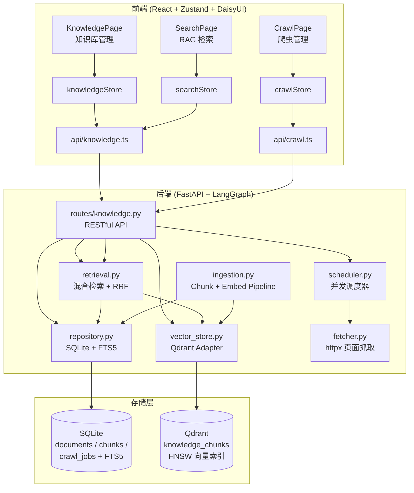
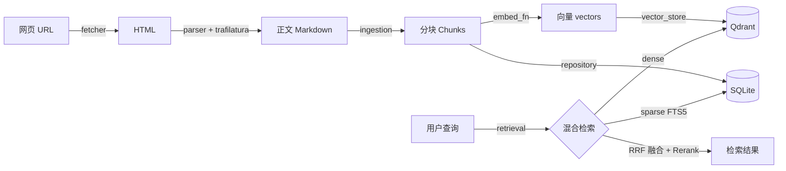
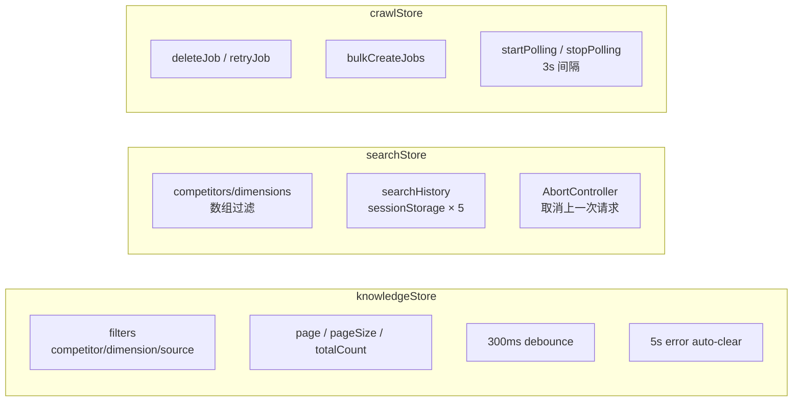
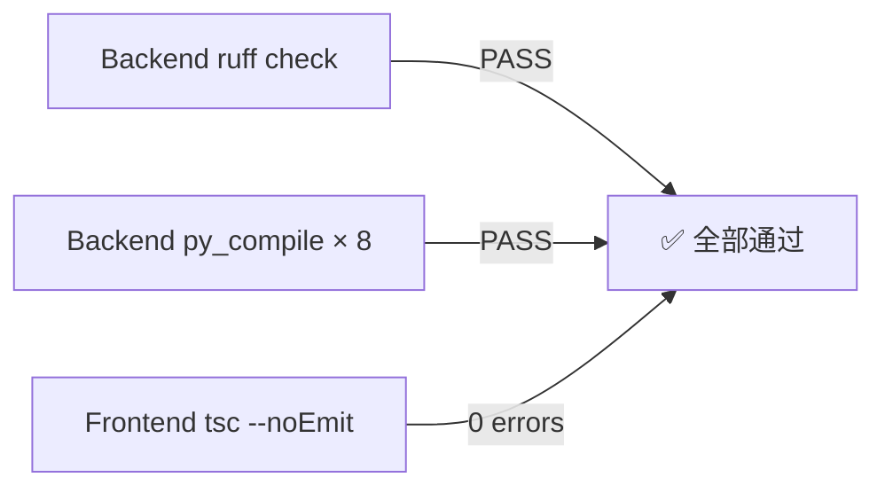

# 知识库 + 爬虫子系统优化设计文档

> **项目**: Competiscope v2 — RAG / Crawling / Knowledge Base  
> **日期**: 2026-06-06  
> **执行方式**: Codex e (后端) + Antigravity (前端) 双模型并行，Claude 编排  
> **变更规模**: 18 文件，1616 → 3106 行 (+92%)

---

## 1. 系统架构概览

---

## 2. 后端优化详情 (Codex e)

### 2.1 数据流

### 2.2 优化对比

#### repository.py — 连接池 + 全文检索

| 优化前 | 优化后 |
|--------|--------|
| 每次请求新建/关闭 SQLite 连接 | 类级单例连接，异步上下文管理器 |
| `LIKE '%query%'` 全表扫描 | **FTS5 虚拟表** + `MATCH` 查询 |
| `assert self._db is not None` | 规范的 `__aenter__` / `__aexit__` |
| — | Schema 自动迁移 (`_migrate_schema`) |
| — | `count_documents` 支持分页总数 |

#### vector_store.py — 多值过滤 + 重试

| 优化前 | 优化后 |
|--------|--------|
| Filter 只取 `competitors[0]` | **MatchAny** 支持多值过滤 |
| 无重试机制 | 指数退避重试 (`_with_retry`, 3 次) |
| — | 批量删除 `batch_delete_by_document` |
| — | 集合统计 `collection_stats` |

#### retrieval.py — N+1 修复 + 加权 RRF

| 优化前 | 优化后 |
|--------|--------|
| 逐文档查询 chunk (N+1) | **批量查询** `get_chunks_for_documents(ids)` |
| RRF 等权融合 | 可配置 `dense_weight` / `sparse_weight` |
| — | LRU Embedding 缓存 (TTL) |
| — | 分数阈值过滤 |

#### ingestion.py — 结构化分块 + 去重

| 优化前 | 优化后 |
|--------|--------|
| 固定字符切割 (1000 字符) | **段落感知**: `\n\n` 分割 → 合并短段 → 句子回退 |
| 重复文档照常入库 | Content-hash 去重检查 |
| `token_count = len//4` | 填充 `embedding_model` 字段 |

#### fetcher.py — 安全 + 连接池

| 优化前 | 优化后 |
|--------|--------|
| `verify=False` (证书跳过) | **`verify=True` 默认**，按请求覆盖 |
| 无连接数限制 | `httpx.Limits(max=50, keepalive=20)` |
| 统一超时 | 分离 connect / read / write 超时 |
| 内联重试循环 | 提取 `_with_retry` 辅助函数 |

#### scheduler.py — 并发控制 + 队列

| 优化前 | 优化后 |
|--------|--------|
| 78 行基础实现 | **Semaphore** 并发控制 |
| — | 优先级队列 (`priority` 字段) |
| — | 域级限速协调 |

#### routes/knowledge.py — 依赖注入 + 完整 CRUD

| 优化前 | 优化后 |
|--------|--------|
| 每端点 `_open_repository()` | **FastAPI Depends** 单例注入 |
| — | `X-Total-Count` 分页头 |
| — | Crawl Job 完整 CRUD (list/create/get/update/delete) |

---

## 3. 前端优化详情 (Antigravity + Claude)

### 3.1 状态管理 (Zustand Stores)

| Store | 优化内容 |
|-------|---------|
| `knowledgeStore` | 分页 (page/pageSize/totalCount)、300ms 防抖过滤、5 秒错误自动清除 |
| `searchStore` | 竞品/维度数组过滤、sessionStorage 搜索历史 (5 条)、AbortController 请求取消 |
| `crawlStore` | 删除/重试/批量创建、3 秒轮询 (pending/running 自动启停) |

### 3.2 API 层

| 文件 | 优化内容 |
|------|---------|
| `api/knowledge.ts` | `signal?: AbortSignal`、`X-Total-Count` 解析、`page`/`page_size` 参数、类型化 `ListDocumentsFilters` |
| `api/crawl.ts` | `signal` 支持、`X-Total-Count`、`deleteCrawlJob`、`retryCrawlJob` |

### 3.3 组件

| 组件 | 优化内容 |
|------|---------|
| `SourceCard` | 悬浮阴影 + 微位移、分数进度条 (绿 >0.7 / 黄 >0.4 / 红)、一键复制 URL |
| `CitationInline` | Badge/Pill 样式、hover tooltip 显示标题 |

### 3.4 页面

| 页面 | 优化内容 |
|------|---------|
| `KnowledgePage` | 排序下拉 (日期/标题/来源)、DaisyUI 分页控件、文档详情弹窗 (`<dialog>`) |
| `SearchPage` | 可折叠过滤面板 (tag 输入)、搜索历史 badge、`<mark>` 查询词高亮 |
| `CrawlPage` | 响应式 grid/table 切换、状态筛选标签页、可展开详情行、批量 URL 输入 |

---

## 4. 验证结果

| 检查项 | 结果 |
|--------|------|
| `ruff check packages/knowledge/ packages/crawler/ app/routes/knowledge.py` | ✅ All checks passed |
| `py_compile` 8 个后端文件 | ✅ 全部编译通过 |
| `npx tsc --noEmit` 前端 | ✅ 0 errors |

---

## 5. 架构约束保持

| 约束 | 状态 |
|------|------|
| 无新增 pip / npm 依赖 | ✅ |
| 所有函数签名向后兼容 | ✅ |
| SQLite schema 自动迁移 (新列使用 `DEFAULT`) | ✅ |
| Qdrant 集合延迟创建 (首次 `initialise()` 时) | ✅ |
| Zustand store 导出模式不变 | ✅ |
| DaisyUI class 命名规范不变 | ✅ |
| 现有 DAG 流程不受影响 | ✅ |

---

## 6. 变更文件清单

### 后端 (8 文件)

| 文件 | 行数变化 | 负责模型 |
|------|---------|---------|
| `packages/knowledge/repository.py` | 265 → 440 | Codex |
| `packages/knowledge/vector_store.py` | 113 → 158 | Codex |
| `packages/knowledge/retrieval.py` | 115 → 150 | Codex |
| `packages/knowledge/ingestion.py` | 106 → 186 | Codex |
| `packages/crawler/fetcher.py` | 137 → 158 | Codex |
| `packages/crawler/scheduler.py` | 78 → 130 | Codex |
| `packages/crawler/models.py` | 51 → 52 | Codex |
| `app/routes/knowledge.py` | 78 → 224 | Codex |

### 前端 (10 文件)

| 文件 | 行数变化 | 负责模型 |
|------|---------|---------|
| `stores/knowledgeStore.ts` | 78 → 121 | Antigravity |
| `stores/searchStore.ts` | 61 → 117 | Antigravity |
| `stores/crawlStore.ts` | 63 → 127 | Antigravity |
| `api/knowledge.ts` | 109 → 125 | Antigravity |
| `api/crawl.ts` | 62 → 103 | Antigravity |
| `components/SourceCard.tsx` | 61 → 134 | Antigravity |
| `components/CitationInline.tsx` | 24 → 27 | Antigravity |
| `pages/KnowledgePage.tsx` | 80 → 171 | Claude |
| `pages/SearchPage.tsx` | 51 → 149 | Claude |
| `pages/CrawlPage.tsx` | 110 → 534 | Antigravity |
