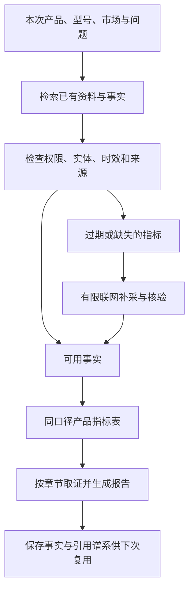

# 竞品调研的 RAG 核查与升级设计

日期：2026-10-02。用户已澄清指当前项目已有的 Qdrant 知识检索、外部资料接入和内部存储。

## 结论与用途

RAG 适合本项目：采集前回忆已核验资料，分析时查证同一产品的指标，写作时按章节取证，并在报告重做时只补缺口。旧报告可以提供研究方向、竞品线索和带来源事实；时效性敏感的信息应重新核验。

当前的复杂度已经超过最简 RAG，但实际启用的语义能力和调研闭环仍不充分。优先提高可用证据比例、型号准确性、时效和引用质量，再用基准验证模型升级的收益。

## 代码与运行现状

| 能力 | 实际情况 | 依据 |
| --- | --- | --- |
| 文档检索 | 支持关键词 + 向量 + RRF、查询改写、重排、MMR、缓存及版本索引 | `knowledge/retrieval.py` |
| Qdrant 当前运行状态 | 本地配置为 localhost:6333；本轮直接连接失败且无该端口监听，未验收真实向量服务 | 本地连接与端口核查；固定基准不能替代服务验收 |
| 采集 Agent 检索 | 固定 sparse；采集入库固定 index_vectors=False | `agents/collectors/kb_bridge.py` |
| 采集入库材料 | 主采集链通常写入标题与摘要；上一轮 Switch 2 正文 12926 字符，但 RawSource 只有 900 字符摘要、无 full_text，入库成功不能代表完整正文已保存 | 上一轮真实 trace、`research/evidence/admission.py`、`agents/collectors/kb_bridge.py` |
| 采集工具重排 | rag_retrieve_tool 没有注入 rerank provider；HTTP 知识检索接口另有 provider 注入 | `tools/rag_retrieve.py`、`app/routes/knowledge.py` |
| 检索缓存 | 文档检索缓存位于 RetrievalService 实例；采集工具每次调用新建并关闭服务，不能据此声称跨采集调用缓存有效 | `tools/rag_retrieve.py`、`knowledge/retrieval.py` |
| 本地 embedding / reranker | 默认并实际配置为 hash；文档向量由全文哈希生成，不能提供语义相似性 | 本地 provider 核查、`knowledge/embeddings.py` |
| 真实语义模型接口 | 已有 BGE-M3、本地 / HTTP provider，但本地未启用；加载失败可退回 hash，状态会标记降级 | `knowledge/embeddings.py`、`knowledge/reranker.py` |
| 企业证据 RAG | 另一套哈希 embedding、BM25、规则加权重排，未共享知识检索服务 | `rag/retriever.py`、`rag/embedder.py`、`rag/reranker.py` |
| 历史报告 | 已有身份、类别、市场、版本、时间和来源检查；最多 3 报告 / 6 事实 / 12000 字符；作为研究提示和原始 URL，不直接作为本次已核验事实 | `memory/report_reuse.py` |
| 数据范围 | 企业证据链有 workspace / project 范围；文档 RetrievalRequest 没有同等范围字段，采集工具只传主体和维度。统一前必须补同一范围契约 | `knowledge/models.py`、`tools/rag_retrieve.py`、`rag/knowledge_bridge.py` |

文档中的“采用 BGE-M3”描述了设计选择，不能当作当前已启用模型的证据。本地状态核查为 hash-embedding-v1 / hash-reranker-v1；本次没有自动下载大模型或创建新的外部 embedding 服务。

Qdrant 已在 `knowledge/vector_store.py` 接入，承担向量索引。SQLite 保留文档、分块和关键词索引。Qdrant 的存在说明有向量存储能力；检索质量仍取决于入库资料、embedding、过滤、排序和下游使用。现有流水线也已经通过 RawSource / CompetitorKB / EvidencePack 传递来源与分析结果，并非完全没有对齐；缺的是统一的检索范围、事实版本和按阶段取证契约。

## 本轮固定基准

执行 `COMPETISCOPE_LOAD_ENV_FILES=0 PYTHONPATH=backend ../plan_a/.venv/bin/python -m packages.knowledge.benchmark`。

| 模式 | Recall@3 | MRR | nDCG@3 |
| --- | --- | --- | --- |
| 关键词 | 0.8571 | 0.7143 | 0.7517 |
| 混合 | 0.9286 | 0.8929 | 0.9022 |
| 混合 + hash 规则重排 | 0.9286 | 0.8571 | 0.8758 |

三组在这批固定样例中均记录引用正确率 1.0、过期来源误用 0、scope_leaks 0。只有 14 条构造查询，embedding 为 64 维 hash、model_calls=0；不能据此推断真实多语言语义检索效果、模型质量或生产权限隔离已充分验收。规则重排在这里降低了排名指标，应使用对照评测决定是否启用。

## 可选方向

1. **只启用语义 embedding 和 reranker。** 接口已有，改动较少，但会增加模型加载、索引迁移和运行资源成本；对空事实、型号混淆和过期资料的问题帮助有限。
2. **推荐：建立可复用证据流程，再逐步启用语义能力。** 保留现有存储和搜索工具，先统一资料、事实、历史报告的角色，再统一范围与时间检查，最后用基准选择检索和重排。可以分阶段验证对报告的收益。
3. **建立完整知识图谱与 GraphRAG。** 对大规模跨产品关系探索有潜在用途，但当前主要失败在产品事实采集和复用；图构建与维护会增加成本，本阶段不采用。

推荐方案属于项目设计判断；[Qdrant 混合检索说明](https://qdrant.tech/documentation/search-tuning/hybrid-search/)支持关键词 / 语义互补以及用测量决定融合方案，不保证某个配置在本项目必然更好。

## 推荐的证据流程

### 1. 三类资料分别承担明确角色

- **原始资料：** 网页、文档、规格表；保存标题、正文段落、表格行、URL、抓取时间、正文哈希和版本。清理导航后再分块，规格标签和值放在同一块；检索时允许恢复相邻上下文。
- **核验事实：** 产品 / 型号、指标、值、单位、市场、有效时间、出处、原文位置和核验状态。硬件比较应区分显示尺寸、分辨率、存储、电池；软件比较应区分套餐、权限和功能边界。同一指标才进入横向比较。
- **历史报告：** 研究问题、判断、建议、用户反馈和未决事项。报告结论是历史观点；只有回到原始出处并满足当前核验政策的事实才支持本次报告。

已有 EvidenceItem / NormalizedField / 企业 ClaimRecord 优先复用；先扩展必要字段与适配，不新增平行事实数据库。

采集入库应从 CapturedPage 的清理正文生成资料记录，RawSource 只保存资料 ID 与短引用。不能为保存正文把全文塞入每个 Agent 的 RawSource 元数据，避免资料持久化同时放大提示 token。

### 2. 检索前过滤与检索后核验

- 输入明确 workspace_id、project_id、产品身份、型号、维度、市场和资料角色；范围由服务端可信运行上下文注入。
- 文档与企业证据两个入口采用同一过滤契约。跨项目复用只在同一有权限工作区内显式请求；未知归属的旧资料进入待确认状态。
- 只在权限和型号范围内做关键词 / 向量召回与重排。不能取出别的工作区资料后仅依赖模型忽略。
- 型号后缀和代际不能在别名归一化时删除；例如 ROG Ally、ROG Ally X、ROG Xbox Ally 不能合并成同一产品事实。
- 同时保留来源发布时间、抓取时间和最后核验时间；本次检索命中时间不刷新历史事实的时效。
- 价格、版本、停售和功能状态优先触发当前核验；稳定规格按明确型号和时间政策复用。没有最新证据时展示“截至上次核验”，避免冒充当前状态。

### 3. 逐步启用真实混合检索

- BM25 / FTS 保留型号、价格和精确名词匹配；语义 embedding 补充同义表达与跨语言召回。
- BGE-M3 是既有接口可用的候选，先以本地或 HTTP 小型验证环境做对照；[官方模型卡](https://huggingface.co/BAAI/bge-m3)说明其多语言与多种检索能力。调用 DeepSeek 生成模型并不会自动将本项目的 hash embedding 替换为语义模型。
- 初始使用已有 RRF，召回 20 个候选，再用真实 reranker 取不超过 5 个上下文块；这一配置是评测起点，不是已证明最优值。[BGE reranker 模型卡](https://huggingface.co/BAAI/bge-reranker-v2-m3)提供候选重排用法。
- provider、模型版本、维数写入索引版本和 diagnostics；模型加载失败显式降级为关键词检索，不把 hash 替代描述成语义检索成功。
- 后台重建新索引，验证后切换；复用已保存文本和 chunk ID，不混用旧 hash 与新语义向量空间。

### 4. Agent 按缺口行动，限制上下文与费用

- 先检索核验事实与原始出处；覆盖充分才减少联网。召回很多相关文档却没有所需事实，仍判定缺口存在。
- 缺口以“哪个产品 / 型号 / 指标 / 市场缺什么证据”描述，每次只补这一项；补采前检查剩余搜索、抓取、token 和费用预算。
- 成功且未过期的资料复用；过期资料优先回到原 URL；原始抓取失败明确交给用户或保留未知。
- 采集工具复用受生命周期管理的检索服务，使范围、索引版本和查询组成缓存键；范围或来源变化时失效。企业检索避免每次查询重复分块和重复生成同一来源向量。
- 给模型的上下文按章节挑选事实、短引用和来源 ID；原始全文保存在资料库，不在每个 Agent 的提示里重复发送。
- 历史结果缓存与来源版本 / 正文哈希绑定；来源变化、删除、撤销或权限变化触发失效。

### 5. 草稿、修复和发布使用同一事实表

证据不足时展示研究草稿、已取得事实和缺口，不把草稿标成可发布报告。半人工模式允许确认型号、替换竞品和提供来源。打回重做只失效被指出的事实与依赖章节，保留其他证据；修复后重新检查相关引用和指标。

## Workflow 内各 Agent 如何对齐

保留现有工作流和 EvidencePack，增加一个受运行上下文约束的检索入口。各 Agent 按职责发起请求，统一服务执行过滤与核验；不要求它们各自连接 Qdrant 或各自解释权限。外部知识检索与内部历史资料入库后都遵守同一契约，并保留各自来源角色。

**请求包含：** 服务端注入的 workspace / project / run、产品实体与型号、市场、维度或指标、资料角色、时效要求、查询和上下文 token 上限。角色范围取自已确认运行计划；来源文本不能修改检索范围或工作流指令。

**结果包含：** evidence_id、document_id、chunk_id、资料版本与正文哈希、产品与型号、指标和值 / 单位、原文短引用与位置、URL、发布时间 / 抓取时间 / 核验时间、核验状态、拒绝原因和剩余缺口。召回分数用于排序，不能代替来源可信度或事实核验状态。

| 阶段 | 检索目标 | 交给下一阶段的内容 |
| --- | --- | --- |
| Planner | 相同用户任务、同类产品及历史研究问题 | 候选竞品与调研范围；历史线索仍需当前身份核验 |
| Collector | 每个产品 / 维度已有且未过期的资料与事实 | 已核验事实与具体缺口；仅为缺口联网补采 |
| Analyst | 该产品所需指标、相邻原文和冲突事实 | 带 evidence_id 的结论；区分事实、推断和未知 |
| Comparator | 不同产品的同一指标及单位、市场、时间 | 可比较项与不可比较原因，禁止混合不同型号 |
| Writer | 每个章节所需的已核验事实和分析结论 | 绑定 evidence_id 的句子与引用，不把旧报告结论当新证据 |
| QA | 按 ID 回读报告所用证据和原文，不再做宽泛召回 | 检查数值、型号、时效和出处；缺证据时返回定向修复目标 |

一次运行保存证据清单与版本快照。后续 Agent 使用同一快照，并能按 ID 获取原始片段。采集或半人工修复引入新事实时，生成新快照版本，只让依赖该事实的分析、比较和章节重新运行，避免上游新事实与下游旧上下文混用。报告发布前校验引用仍指向有效版本。

这里的“对齐”要求共同身份、版本和出处；各 Agent 获取的片段随职责变化。把所有文档全文复制给所有 Agent 会增加 token，并掩盖关键指标，不作为实现方案。

## 什么算合格：项目验收标准

以下是本项目拟采用的验收门槛，需用人工可回查评测集验证，不是行业统一标准。当前 14 条固定样例不足以完成验收。

1. **找得到：** 至少 50 条代表性查询包含精确型号、同义表达、中英文、指标和无答案案例；关键词、混合、重排同集对照。初始 Recall@5 目标 ≥ 90%，同时报告 nDCG 和各产品类别失败案例，不能只用平均数掩盖某类产品失效。
2. **范围正确：** workspace / project / 型号过滤在召回前执行；跨工作区、不同代际和未授权来源用例不得泄漏。外部接口的 scope 字段不能覆盖可信服务端上下文。
3. **证据可回查：** 所有对外事实性断言具备有效证据 ID；原文位置、URL 与版本可回读。数值、单位、市场和型号与证据一致；无法确认则写明未知。引用正确性与答案支持度分别检查。
4. **时间正确：** 过期价格、功能状态和版本进入刷新或明确标注历史时间；新检索不能重置旧事实核验时间。撤销、删除或更新来源后，缓存与依赖事实同步失效。
5. **流程一致：** 人为更正一个规格后，Analyst / Comparator / Writer / QA 必须看到同一新版本；只重做受影响范围。检索没有所需指标时，Collector 明确报告缺口，不把相关文档数量当作覆盖充分。
6. **能退化、能测量：** Qdrant 或语义服务不可用时，显式降级为关键词或无结果；不得声称语义检索成功。每次记录 provider、索引版本、过滤数、命中证据 ID、拒绝原因、上下文 token 和延迟；同任务对照测报告质量、抓取次数、token 与 p95。

后两阶段验收至少包含一次完整真实运行和一次历史资料复用运行，证明相同正确性下减少重复采集或提示 token，再决定是否扩大使用。

## 阶段与验收

1. **当前采集修复：** 查询主体、正文结构、事实覆盖；先用固定回放验证，再执行一次真实报告。
2. **证据复用与范围：** 统一检索范围和出处字段、结构化指标、时效和草稿缺口。验证跨工作区拒绝、同名不同型号拒绝、过期价格进入刷新、未失效规格减少重复抓取。
3. **语义检索与重排：** 启用独立语义 provider、重建索引、统一两个入口的检索核心；保证关键词降级可用。先基准，再真实请求。
4. **评测与参数选择：** 增加至少 50 条人工可回查案例，覆盖硬件、普通软件、消费应用、电商与 AI 产品；留出评测集，比较关键词 / 混合 / 混合重排。分别测 Recall@5、nDCG、引用正确性、事实一致性、时效误用、范围泄漏、token 和 p95 延迟。

检索召回与回答忠实度分别评测；[Ragas 指标说明](https://docs.ragas.io/en/stable/concepts/metrics/available_metrics/context_precision/)可参考。模型评分只作辅助，型号、数值、URL、引用位置和权限用可复现检查核验。

### 下一阶段的最小实施范围

实施前先恢复并核查现有 Qdrant 服务的连接、集合版本和持久化；用实际服务完成写入、检索、重启后读取及删除来源测试。恢复服务并不替代后续检索质量验收。

| 顺序 | 改动边界 | 必要验证 |
| --- | --- | --- |
| 1. 完整资料与范围 | `knowledge/models.py`、`repository.py`、`ingestion.py`、`vector_store.py`、`retrieval.py`；两个检索入口及 Collector 传入可信范围、正文资料引用与时效要求 | 正文摘要之外的规格可召回；跨工作区与错误型号拒绝；旧未知范围资料不会默认共享 |
| 2. 工作流证据契约 | 复用现有研究 / 运行状态与 Writer EvidencePack；为各阶段提供受范围限制的检索适配、证据 ID 与快照版本 | 修正一个事实后各 Agent 一致；按 ID 回查引用；未改事实与章节不重复重做；上下文预算生效 |
| 3. 真实语义检索对照 | 既有 embedding / reranker provider、版本索引和基准入口；先小批资料验证，再迁移独立索引 | 型号精确匹配保留；中英文同义召回优于关键词基线；失败明确退回关键词；没有混合向量空间 |

每一步先红测、再最小实现、独立审查和回归。第一步优先；真实模型部署根据运行资源和对照结果决定。阶段 2 的新草稿界面可以独立排期，避免阻塞资料、权限与证据契约修复。

本设计是 RAG 新增实施范围的待评审方案。当前采集根因修复已有用户确认；语义服务部署、索引迁移和新的草稿交互尚未按本设计实施。
